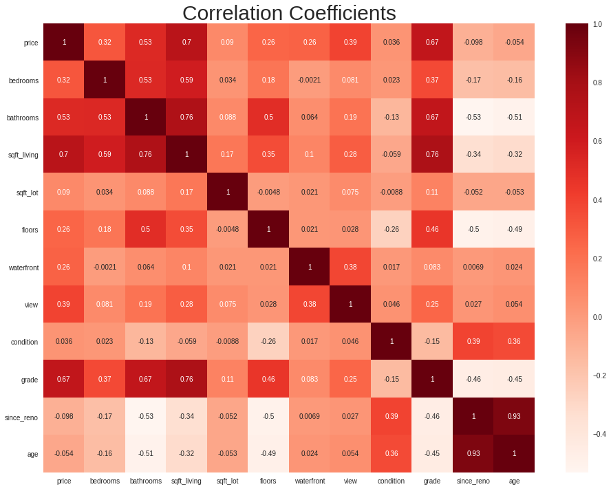

<h1>King County Housing Price Project</h1>

Author: Jason Lombino

For more information on this project please see my <a href= https://github.com/jlombino/dsc-phase-2-project-v2-3/blob/main/slides.pdf>Presentation</a> or <a href= https://github.com/jlombino/dsc-phase-2-project-v2-3/blob/main/Final_Notebook.ipynb>Jupyter Notebook</a>
<br>

<h1>Business Problem</h1>
The mortgage department at Bentley & Co. Bank of Seattle is looking for an additional method of appraising the value of homes. They currently hire an appraisal management company, and will continue to do so. However, as independant appraisals can be costly and take time, Bentley & Co. Bank is looking for a tool that can estimate the value of a house cheaply and quickly.

 This will be useful for obtaining a ballpark estimate of the value of a home before an appraisal can be performed. In addition, it will be useful for estimating the price impact of any renovations performed on a house Bentley & Co. Bank has written a mortgage on without any additional appraisals.

This tool must meet two criteria to be of use to Bentley & Co. Bank:
<ol>
<li>The tool must be capable of accurately predicting the price of a house provided information about the house.</li>
<li>The tool must provide insight into what factors impact the price of a house the most.</li>
</ol>

<h1>Goals</h1>

Bentley Bank & Co. can use the models created in this notebook to generate a range of prices a given house can be expected to fall into. 

<h1>Data</h1>

All of the data used in this project can be found in the Data folder.

The data provided in 'kc_house_data.csv' contains information on 21 thousand homes sold in the King County, WA area between 2014 and 2015. The description of the column names can be found in 'column_names.md' in the same folder.

I used the following features in this project:

<ul>
<li>Price [Target]</li>
<li>No. of Bedrooms</li>
<li>No. of Bathrooms</li>
<li>Sq. Footage of Living Space</li>
<li>Sq. Footage of Lot</li>
<li>No. of Floors</li>
<li>Whether the home was Waterfront</li>
<li>The View from the home</li>
<li>The Condition the home was in</li>
<li>The Grade of the home</li>
<li>The Year the home was Built</li>
<li>The Year of the most recent Renovation</li>
<li>The Location of the home</li>
</ul>

The data provided in 'zips.csv' contains a list of zipcodes and the corresponding city for each zipcode in King County, WA.

All of the data was converted to numeric scales except location which needed to be one-hot-encoded to work in the model.

<h1>Exploratory Data Analysis</h1>

<h2>Distrobution of Features</h2> 
This plot shows how each numeric variable in the homes dataframe is distributed. Age and Since_reno seem to be very similar. Price and both sqft columns seem to be good candidates for log transformations.<br>


<br>
<h2>Linearity of Features</h2>
This helps to visualize which variables have linear relationships with price.<br>


<br>
<h2>Price vs. Location</h2>
Location appears to have a huge impact on price. This chart shows the median price for the top 10 locations.<br>


<br>
<h2>Correlation Between Features</h2>
Just a standard correlation coefficient matrix.<br>
<br>

<h1>Methods</h1>

I utilized SciKitLearn, StatsModels, and SciPy to create three linear regression models capable of estimating house prices.


<h1>Models & Results</h1>

<h2>Basic</h2>
The first basic model only considered the square footage of the living space when estimating price.<br>
This model had a Pearson Coefficient of 0.488 on the train data and 0.509 on the test data.<br>
This model had an RMSE of approximately $250,000.<br>
Coefficients can be found in my <a href= https://github.com/jlombino/dsc-phase-2-project-v2-3/blob/main/Final_Notebook.ipynb>Jupyter Notebook</a>

<h2>Medium Complexity</h2>
The second medium complexity model considered all available predictors when estimating price.<br>
This model had a Pearson Coefficient of 0.728 on the train data and 0.762 on the test data.<br>
This model had an RMSE of approximately $190,000.<br>
Coefficients can be found in my <a href= https://github.com/jlombino/dsc-phase-2-project-v2-3/blob/main/Final_Notebook.ipynb>Jupyter Notebook</a>

<h2>Best Model</h2>
The third and best model condisered most features and applied transformations to some before using them to estimate price.<br>
This model had a Pearson Coefficient of 0.779 on the train data and 0.783 on the test data.<br>
This model had an RMSE of approximately $160,000.<br>
Coefficients can be found in my <a href= https://github.com/jlombino/dsc-phase-2-project-v2-3/blob/main/Final_Notebook.ipynb>Jupyter Notebook</a>


<br><h2>Model Predictions</h2>
The following graph shows the predictions for each model plotted against the actual price value for each home in the test set. Ideally, the points would mirror the plotted line (y=x) meaning that the predicted value exactly matches the actual value for each point.<br>


<br><h2>Model Validation</h2>
There are three assumptions made when using a linear regression model.

<ol>
<li><b>Linearity</b>: Is there a linear relationship between the target and the predictors?</li>

We looked at this during the exploratory data analysis.

<li><b>Homoscedasticity</b>: Does the variance of the residuals change based on the value of the target?</li>

We looked at this in the comparing model predictions section. It does appear that the residuals variance increases as price increases. I am not sure if this is statistically significant because I was unable to get the code for the Goldfeld-Quandt test working.

<li><b>Normality</b>: Are the residuals of the model normally distributed?</li>

We will look at this below.
</ol>

<h2>Normality Assumption</h2>
The basic and medium models perform poorly in terms of normality of the residuals. The best model's residuals are pretty normally distributed however, only really deviating at the tails.<br>


<h1>Conclusion</h1>

We were successful in creating a model that Bentley & Co. Bank can use to predict the price of a home given information about its features.

<ul>
<li>A linear regression model was appropriate for predicting home price using the provided dataset.</li>
<li>78 Percent of the variance in home price can be explained by the selected home features in the best model.</li>
</ul>

The following features proved to be the most important when predicting the price of a home:
<ol>
<li>Location</li>
<li>Grade</li>
<li>Living Area Square-Footage</li>
</ol>
 
 <b>I recommend that Bentley & Co. Bank use the best model for quick-and-dirty estimates of home price before a professional appraisal can be performed.

 I recommend that Bentley & Co. Bank use the best model to estimate the price impact of renovations on homes it has an interest in when an additional appraisal is not appropriate.</b>

 # Repository Information
```
├── README.md                        <- The top-level README you are currently reading
├── Description.md                   <- Project description and requirements provided by upstream
├── Final_Notebook.ipynb             <- Jupyter notebook with my full analysis
├── Final_Notebook.pdf               <- PDF version of project Jupyter notebook
├── slides.pdf                       <- PDF version of project presentation
├── data                             <- Project data provided by upstream
└── images                           <- Graphs generated from code
```